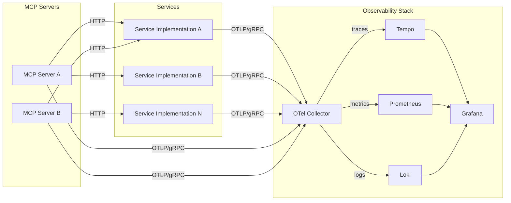

# OTel Polyglot

[](https://github.com/CameronXie/otel-polyglot/actions/workflows/ci.yaml)

A polyglot project for validating OpenTelemetry SDK implementations across multiple
languages. Each service implements an identical API surface and emits the same telemetry
signals, enabling direct comparison of instrumentation patterns and consistent evaluation
of observability backends.

## Architecture

Each service exports traces, metrics, and logs over gRPC (OTLP) to an OpenTelemetry
Collector, which routes each signal type to its respective backend for storage and
visualisation.



The local development environment uses
[Grafana OTel LGTM](https://github.com/grafana/docker-otel-lgtm), an all-in-one
container that bundles the OTel Collector, Loki, Grafana, Tempo, and Prometheus.

## Service Specification

All service implementations must conform to this contract. The specification defines
the HTTP endpoints each service exposes, the request and response payloads, and the
OpenTelemetry signals it must emit.

### Endpoints

| Endpoint   | Method | Description                                              |
|------------|--------|----------------------------------------------------------|
| `/health`  | GET    | Returns service health status                            |
| `/forward` | GET    | Forwards GET requests to all configured URLs in parallel |

### Endpoint Payloads

#### `GET /health`

**Response** `200 OK`

```json
{
  "status": "healthy"
}
```

#### `GET /forward`

Sends concurrent GET requests to every URL configured via the service's forward URL
setting and returns aggregated results. Individual request failures are included in the
response rather than failing the entire batch.

**Response** `200 OK`

```json
{
  "results": [
    {
      "url": "https://httpbin.org/get",
      "status_code": 200,
      "body": "...",
      "duration_seconds": 0.152
    }
  ]
}
```

**Error Response** `500 Internal Server Error`

```json
{
  "error": "batch processing failed"
}
```

### Service Telemetry Signals

Every service must emit the following OpenTelemetry signals. Span names, metric
instrument names, and log export mechanisms must match across all implementations.

| Signal  | Name                               | Description                               |
|---------|------------------------------------|-------------------------------------------|
| Traces  | HTTP server/client spans           | Auto-instrumented by the framework        |
| Traces  | `forward.batch`, `forward.request` | Custom spans for forward operations       |
| Metrics | `forward.requests`                 | Counter — total outbound forward requests |
| Metrics | `forward.duration`                 | Histogram — outbound request duration (s) |
| Logs    | Application logs                   | Structured logs exported via OTLP         |

### Service Telemetry Details

#### Traces

| Endpoint   | Span Name         | Kind     | Description                                     |
|------------|-------------------|----------|-------------------------------------------------|
| All        | HTTP server spans | Server   | Auto-instrumented by the framework middleware   |
| `/forward` | `forward.batch`   | Internal | Parent span covering the entire batch operation |
| `/forward` | `forward.request` | Client   | One child span per forwarded URL                |

Context propagation: W3C Trace Context, W3C Baggage.

#### Metrics

| Endpoint   | Name               | Type      | Unit | Attributes                     |
|------------|--------------------|-----------|------|--------------------------------|
| `/forward` | `forward.requests` | Counter   | `1`  | `server.address`, `url.scheme` |
| `/forward` | `forward.duration` | Histogram | `s`  | `server.address`, `url.scheme` |

Histogram bucket boundaries (seconds):
`0.001, 0.005, 0.01, 0.025, 0.05, 0.1, 0.25, 0.5, 1, 2.5, 5, 10`

#### Logs

Structured logs exported via OTLP. Every log record must include the active trace and
span ID for correlation with distributed traces.

| Endpoint   | Message                            | Level | Context                  | Attributes                  |
|------------|------------------------------------|-------|--------------------------|-----------------------------|
| `/forward` | `Starting forward batch`           | Info  | Batch operation started  | `url.count`, `baggage`      |
| `/forward` | `Forward batch completed`          | Info  | Batch succeeded          | `results.count`             |
| `/forward` | `Batch processing failed`          | Error | Batch failed             | `error`                     |
| `/forward` | `Failed to execute request`        | Error | HTTP request failed      | `error`                     |
| `/forward` | `Unexpected error in forward task` | Error | Unexpected exception     | `error`                     |
| `/forward` | `Upstream returned error status`   | Warn  | Upstream HTTP 4xx/5xx    | `http.response.status_code` |
| `/forward` | `Request completed successfully`   | Info  | Single request succeeded | —                           |

## Services

The table below lists available service implementations. Each implements the full
[service specification](#service-specification) in a different language and framework.
Refer to individual READMEs for language-specific configuration and development
instructions.

| Service    | Language | Framework | Docs                            |
|------------|----------|-----------|---------------------------------|
| go-gin     | Go       | Gin       | [README](./services/go-gin)     |
| py-fastapi | Python   | FastAPI   | [README](./services/py-fastapi) |

## MCP Specification

MCP (Model Context Protocol) servers expose tools for AI clients to invoke. In
this project, those tools call service endpoints over HTTP and emit OTel traces,
metrics, and logs for each invocation. All MCP server implementations must emit
the OpenTelemetry signals defined below.

### MCP Telemetry Signals

Metric attributes: `mcp.tool.name` on all instruments; `mcp.tool.status` on
`mcp.tool.calls` and `mcp.tool.duration`.

| Signal  | Name                | Type            | Description                                      |
|---------|---------------------|-----------------|--------------------------------------------------|
| Traces  | `mcp.tool/{name}`   | Internal span   | One span per tool invocation                     |
| Traces  | HTTP client spans   | Client          | Auto-instrumented fetch() with W3C Trace Context |
| Metrics | `mcp.tool.calls`    | Counter         | Total tool invocations                           |
| Metrics | `mcp.tool.duration` | Histogram       | Tool execution duration (ms)                     |
| Metrics | `mcp.tool.active`   | Up-Down Counter | In-flight tool calls                             |
| Logs    | Application logs    | OTLP            | Structured logs exported via OTLP                |

## MCP Servers

The table below lists available MCP server implementations. Each emits the
[MCP telemetry signals](#mcp-telemetry-signals). Refer to individual READMEs
for language-specific configuration and development instructions.

| Server | Language   | Transport                    | Docs               |
|--------|------------|------------------------------|--------------------|
| ts-mcp | TypeScript | stdio, streamable-http       | [README](./mcp/ts) |

## Observability Stack

The default Docker Compose profile starts the observability backend using
[Grafana OTel LGTM](https://github.com/grafana/docker-otel-lgtm). This single
container bundles an OTel Collector, Loki, Grafana, Tempo, and Prometheus.

| Component      | URL / Port              | Description                             |
|----------------|-------------------------|-----------------------------------------|
| Grafana        | http://localhost:3000   | Unified dashboards for all signal types |
| Prometheus     | http://localhost:9000   | Metrics storage and querying            |
| OTel Collector | `localhost:4317` (gRPC) | Receives OTLP traces, metrics, and logs |
| Tempo          | (internal)              | Distributed trace storage               |
| Loki           | (internal)              | Log aggregation and querying            |

The LGTM container uses its built-in OTel Collector and default backend configuration.
The Prometheus scrape configuration is customised via `prometheus/prometheus.yaml`,
which is mounted into the container at startup. The `otel/collector/config.yaml`
defines a standalone collector configuration for use outside the LGTM image.

## Project Structure

```
.
├── CHANGELOG.md          # Release history
├── CLAUDE.md
├── Makefile              # Root-level build and orchestration targets
├── README.md
├── certs                 # TLS certificates (auto-generated by make up)
├── docker
│   └── dev               # Development container with Claude Code
├── docker-compose.yml    # Service profiles and observability stack
├── mcp                   # MCP server implementations
│   └── ts                # TypeScript MCP server
├── otel                  # OTel Collector configuration overrides
│   └── collector
├── prometheus            # Prometheus scrape configuration
│   └── prometheus.yaml
└── services
    ├── go-gin            # Go-Gin implementation
    └── py-fastapi        # Python-FastAPI implementation
```

## Local Development

The development environment runs entirely in Docker. The root Makefile provides targets
for starting the observability stack, running individual services, and executing tests.

A standalone development container (`dev` profile) is also available. It mounts the
full project and includes [Claude Code](https://docs.anthropic.com/en/docs/claude-code)
for AI-assisted development.

### Requirements

- Docker
- Docker Compose

### Make Targets

```bash
make up PROFILES=<service>      # Start observability stack and the specified service
make down                       # Stop and remove all containers
make ci                         # Run CI checks for all services and MCP servers in Docker
make ci-<name>                  # Run CI checks for a service or MCP server (e.g., make ci-go-gin, make ci-ts-mcp)
make ci-mcp                     # Run CI checks for all MCP servers
make build                      # Build Docker images for all services and MCP servers
make docker-build-<service>     # Build Docker image for a single service (e.g., make docker-build-go-gin)
make docker-build-mcp-<server>  # Build Docker image for an MCP server (e.g., make docker-build-mcp-ts-mcp)
make lint-actions               # Lint GitHub Actions workflows
```

The `up` target always starts the observability stack (`default` profile). Pass
`PROFILES=<service>` to additionally start a service container — for example,
`make up PROFILES=go-gin`. Use `PROFILES=dev` to start the development container
with Claude Code, or combine profiles with `PROFILES=dev,go-gin`.

## TLS / Certificates

The `certs/` directory contains self-signed TLS certificates for secure communication
between services and the OTel Collector. Running `make up` generates these automatically
if they do not exist.

| File                 | Purpose                      |
|----------------------|------------------------------|
| `ca.crt`             | Certificate authority        |
| `otel-collector.crt` | Collector server certificate |
| `otel-collector.key` | Collector private key        |

> **Warning:** These certificates are for local development only. Do not use them in
> production environments.

## Troubleshooting

Common issues when running services with the observability stack.

| Problem                          | Cause                              | Fix                                                           |
|----------------------------------|------------------------------------|---------------------------------------------------------------|
| No traces or metrics in Grafana  | Collector endpoint not reachable   | Verify `OTEL_EXPORTER_OTLP_ENDPOINT` and network connectivity |
| `/forward` returns empty results | No forward URLs configured         | Set the service's forward URLs env var or CLI flag            |
| TLS handshake errors             | Connecting to a non-TLS collector  | Set `OTEL_EXPORTER_OTLP_INSECURE=true`                        |
| Upstream request timeouts        | Target URL too slow or unreachable | Check target URLs; timeout values are service-specific        |
